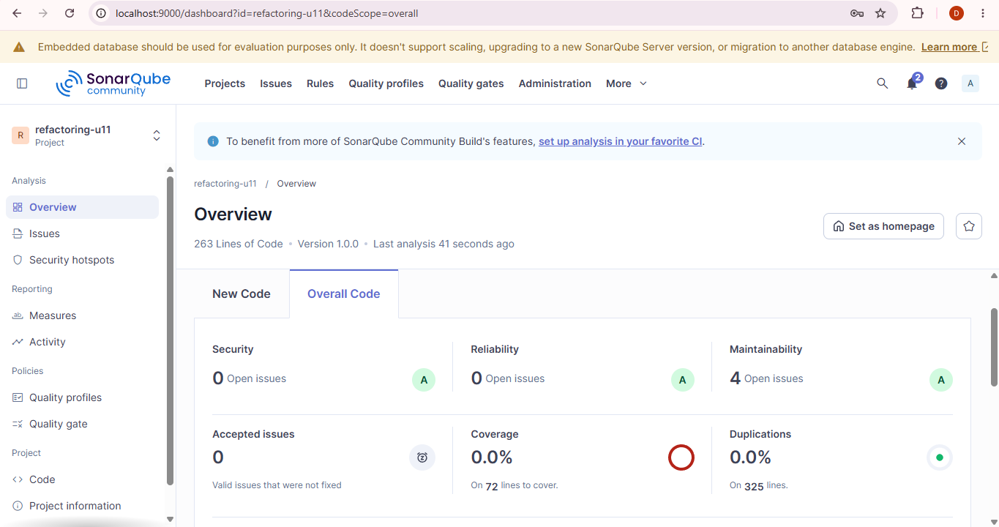

# Refactorizacion Avanzada U11 — Post 1
Juan Sebastian Gelvez Botia - 02230131065

## Objetivo
Eliminar code smells tipo Bloater aplicando Extract Method, Extract Class y Value Objects.

El estudiante identifica code smells de tipo Bloater (Long Method, Large Class, Primitive
Obsession) en un servicio Spring Boot y los elimina aplicando las tecnicas Extract
Method, Extract Class e introduccion de Value Objects, verificando con SonarQube que
la complejidad ciclomatica disminuye y la mantenibilidad mejora.

## Alcance
- Antes: metodo largo con validaciones, calculo y notificacion en un solo flujo.
- Despues: uso de `DatosCliente`, `Direccion`, `NotificacionService` y metodos extraidos.

## Metricas despues de refactorizar
| Metrica | Antes | Despues |
|---------|-------|---------|
| CC procesarPedido | 40 | 8 |
| Code Smells | 284 | 263 |
| TDR | 6 | 4 |

## Tecnicas aplicadas
- Value Object: `DatosCliente` y `Direccion` para eliminar Primitive Obsession.
- Extract Method: separar validacion, calculo, descuento y persistencia.
- Extract Class: `NotificacionService` para sacar la responsabilidad de notificar.

## Evidencias SonarQube

## Ejecucion local
1. Ejecutar `mvn clean verify`.
2. Ejecutar `mvn sonar:sonar -Dsonar.token=qa_dd67ff30beb78f8da3fb29f71365d1b648dc998f`.

